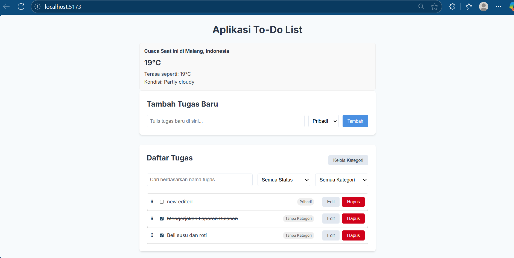
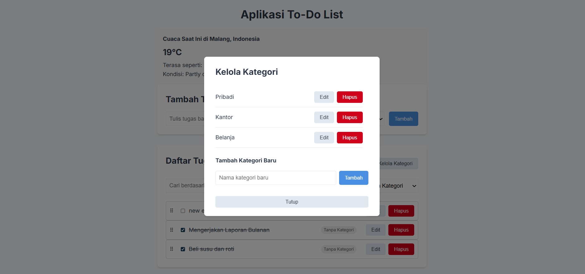
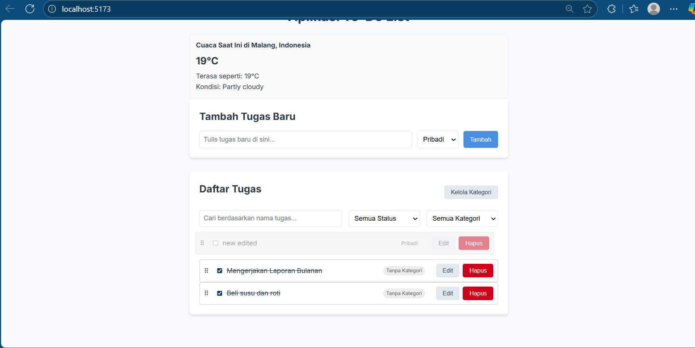

# Aplikasi To-Do List Modern (React + Redux Saga)

Ini adalah sebuah prototipe aplikasi to-do list canggih yang dibangun menggunakan React dan ekosistem modernnya. Aplikasi ini dirancang tidak hanya untuk menjadi to-do list biasa, tetapi juga sebagai demonstrasi implementasi berbagai konsep penting dalam pengembangan frontend, seperti state management yang kompleks, side effects, persistensi data, dan UI yang interaktif.

## Tampilan Aplikasi (Screenshot)





## Fitur Utama

Aplikasi ini memiliki serangkaian fitur yang lengkap:

* **Manajemen Tugas (CRUD):**
    * ✅ Tambah tugas baru.
    * ✅ Edit teks dan kategori tugas yang sudah ada.
    * ✅ Hapus tugas dengan dialog konfirmasi.
    * ✅ Tandai tugas sebagai "selesai" atau "aktif".

* **Manajemen Kategori (CRUD):**
    * ✅ Manajer kategori dalam bentuk pop-up/modal.
    * ✅ Tambah, edit, dan hapus kategori secara dinamis.
    * ✅ Tugas akan otomatis diperbarui jika kategori induknya dihapus.

* **Interaktivitas & UX:**
    * ✨ **Drag & Drop:** Urutkan ulang daftar tugas dengan mudah.
    * 🔍 **Filter & Pencarian:** Saring tugas berdasarkan status (selesai/aktif), kategori, dan kata kunci pencarian.
    * 🛡️ **Konfirmasi Hapus:** Mencegah kehilangan data yang tidak disengaja.

* **Teknologi Canggih:**
    * 🌐 **Widget API Real-time:** Mengambil dan menampilkan data cuaca terkini menggunakan Redux-Saga untuk menangani *side-effects*.
    * 🔌 **Offline First:** Data tugas dan kategori tersimpan di browser menggunakan `redux-persist`, sehingga tidak akan hilang bahkan setelah browser ditutup.
    * 💅 **UI Modern:** Antarmuka yang didesain secara kustom menggunakan `styled-components` untuk tampilan yang bersih dan profesional.

## Tumpukan Teknologi (Tech Stack)

* **Framework:** [React.js](https://react.dev/)
* **Build Tool:** [Vite](https://vitejs.dev/)
* **State Management:**
    * [Redux Toolkit](https://redux-toolkit.js.org/) (untuk state management yang efisien)
    * [Redux-Saga](https://redux-saga.js.org/) (untuk mengelola *side effects* seperti API calls)
* **Styling:** [Styled Components](https://styled-components.com/)
* **Data Persistence:** [Redux Persist](https://github.com/rt2zz/redux-persist)
* **Drag & Drop:** [@dnd-kit](https://dndkit.com/)
* **HTTP Client:** [Axios](https://axios-http.com/)
* **Utilities:** [nanoid](https://github.com/ai/nanoid) (untuk ID unik)

## Instalasi dan Cara Menjalankan

Untuk menjalankan proyek ini secara lokal, ikuti langkah-langkah berikut:

1.  **Clone repository ini:**
    ```bash
    git clone https://github.com/hadi-rch/fujitsu
    ```

2.  **Masuk ke direktori proyek:**
    ```bash
    cd todo-list
    ```

3.  **Install semua dependency yang dibutuhkan:**
    ```bash
    npm install
    ```

4.  **Jalankan server development:**
    ```bash
    npm run dev
    ```

5.  Buka browser Anda dan navigasi ke `http://localhost:5173` (atau alamat lain yang ditampilkan di terminal).

---

Proyek ini merupakan perjalanan lengkap dari ide dasar hingga menjadi aplikasi yang fungsional dan matang secara visual.